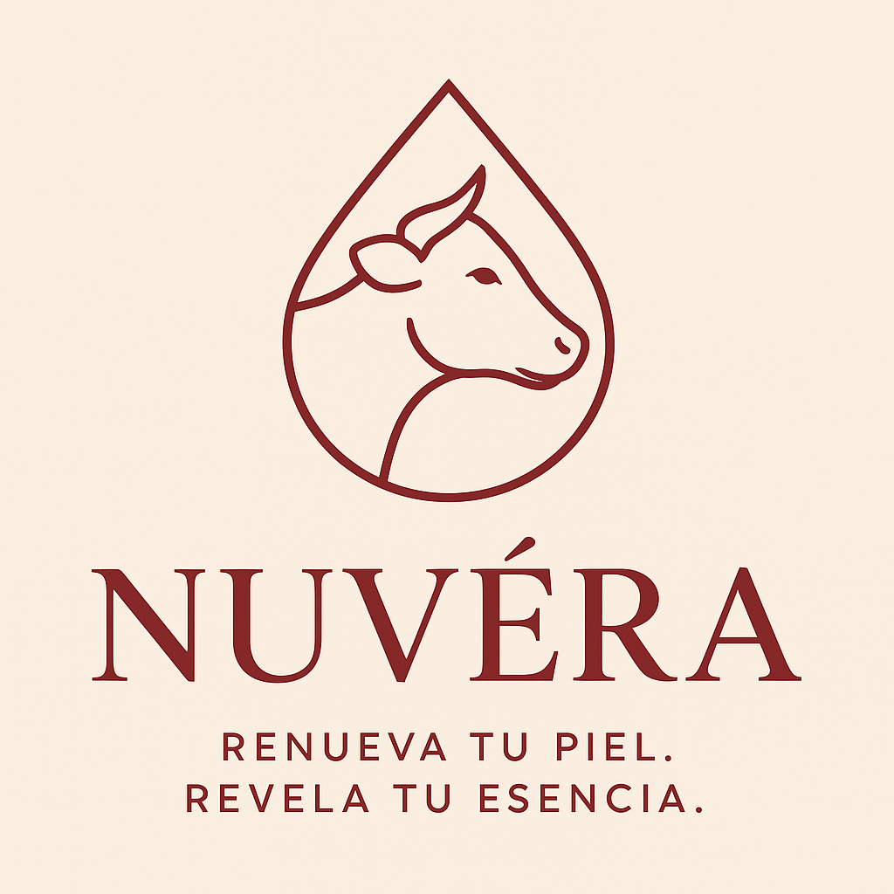
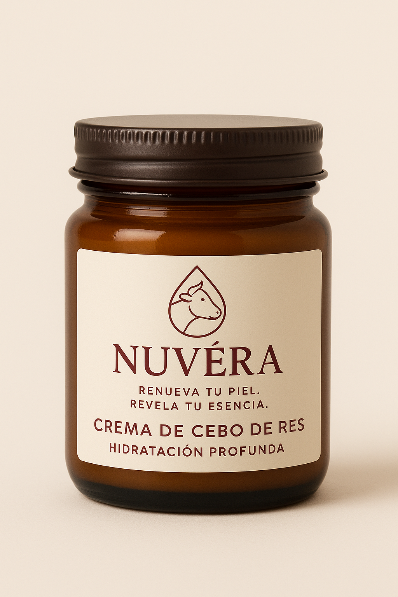

<html lang="es">
<head>
  <meta charset="utf-8" />
  <meta name="viewport" content="width=device-width,initial-scale=1" />
  <title>Nuvéra — Renovación natural para tu piel</title>
  <meta name="description" content="Nuvéra: cremas naturales a base de cebo de res para renovar y nutrir la piel. Producto artesanal, ingredientes transparentes y efectividad comprobada." />
  <link rel="preconnect" href="https://fonts.googleapis.com">
  <link rel="preconnect" href="https://fonts.gstatic.com" crossorigin>
  <link href="https://fonts.googleapis.com/css2?family=Inter:wght@300;400;600;800&display=swap" rel="stylesheet">
  
</head>
<body>
  

    <header>
      

        
        

          <strong>Nuvéra</strong>
          
Cuidado natural con cebo de res para renovar la piel

        

      

      <nav aria-label="principal">
        <a href="#producto" style="margin-right:14px;color:var(--vino);font-weight:600;text-decoration:none">Producto</a>
        <a href="#beneficios" style="margin-right:14px;color:var(--gris);text-decoration:none">Beneficios</a>
        <a href="#contacto" style="color:var(--gris);text-decoration:none">Contacto</a>
      </nav>
    </header>

    <main>
      <section class="hero">
        

          <h1>Nuvéra — Renovación natural para tu piel</h1>
          
Crema artesanal a base de <strong>cebo de res</strong> formulada para nutrir, reparar y renovar la piel. Ingredientes simples, efectos reales: hidratación profunda, equilibrio de la barrera cutánea y textura aterciopelada.

          

            <button class="btn">Comprar ahora</button>
            <button class="btn-outline">Ver ingredientes</button>
          

          

            

              <h4>Natural & efectivo</h4>
              
Formulado con cebo de res purificado y extractos botánicos.

            

            

              <h4>Artesanal</h4>
              
Producido en pequeños lotes para garantizar calidad.

            

            

              <h4>Sin aditivos agresivos</h4>
              
Libre de parabenos, sulfatos y fragancias sintéticas.

            

          

        

        <!-- 🧴 TARRO DE PRODUCTO -->
        <aside class="product-card" id="producto" aria-labelledby="producto-title">
          

            
          

          <h3 id="producto-title" style="margin:14px 0 0">Crema Nuvéra — 60 ml</h3>
          
$28.000 COP

          
Renueva la piel aportando lípidos naturales y mejorando la textura.

          

            <button class="btn" style="flex:1" onclick="window.location.href='#form-compra'">Añadir al carrito</button>
            <button class="btn-outline" style="flex:1" onclick="window.location.href='#form-compra'">Comprar en 1 clic</button>
          

        </aside>
      </section>

      <section id="beneficios">
        <h2 style="margin:4px 0 12px">Beneficios principales</h2>
        

          <article style="background:white;padding:18px;border-radius:12px;box-shadow:0 6px 18px rgba(0,0,0,0.04)">
            <h3>Hidratación profunda</h3>
            
El cebo de res aporta lípidos semejantes a los naturales de la piel, ayudando a retener humedad.

          </article>
          <article style="background:white;padding:18px;border-radius:12px;box-shadow:0 6px 18px rgba(0,0,0,0.04)">
            <h3>Regeneración celular</h3>
            
Estimula la reparación de la barrera cutánea y mejora la apariencia de líneas finas.

          </article>
          <article style="background:white;padding:18px;border-radius:12px;box-shadow:0 6px 18px rgba(0,0,0,0.04)">
            <h3>Textura sedosa</h3>
            
Deja la piel con una sensación no grasosa y un acabado aterciopelado.

          </article>
        

      </section>

      <section id="contacto">
        <h2 style="margin:4px 0 12px">Contáctanos o finaliza tu compra</h2>
        

          <form id="form-compra" style="background:white;padding:18px;border-radius:12px;box-shadow:0 6px 18px rgba(0,0,0,0.04)" onsubmit="event.preventDefault();alert('Gracias por tu compra — formulario demo (sin backend)');">
            <label for="name" style="display:block;margin-bottom:8px;font-weight:600">Nombre completo</label>
            <input id="name" name="name" required placeholder="Tu nombre" style="width:100%;padding:10px;border-radius:8px;border:1px solid #e7e7e7;margin-bottom:12px" />

            <label for="email" style="display:block;margin-bottom:8px;font-weight:600">Correo electrónico</label>
            <input id="email" name="email" type="email" required placeholder="correo@ejemplo.com" style="width:100%;padding:10px;border-radius:8px;border:1px solid #e7e7e7;margin-bottom:12px" />

            <label for="direccion" style="display:block;margin-bottom:8px;font-weight:600">Dirección de envío</label>
            <input id="direccion" name="direccion" required placeholder="Calle 123 #45 - 67, Ciudad" style="width:100%;padding:10px;border-radius:8px;border:1px solid #e7e7e7;margin-bottom:12px" />

            <label for="telefono" style="display:block;margin-bottom:8px;font-weight:600">Teléfono</label>
            <input id="telefono" name="telefono" type="tel" required placeholder="+57 300 000 0000" style="width:100%;padding:10px;border-radius:8px;border:1px solid #e7e7e7;margin-bottom:12px" />

            <label for="message" style="display:block;margin-bottom:8px;font-weight:600">Mensaje o notas del pedido</label>
            <textarea id="message" name="message" rows="3" placeholder="¿Deseas algo especial con tu pedido?" style="width:100%;padding:10px;border-radius:8px;border:1px solid #e7e7e7;margin-bottom:12px"></textarea>

            <button class="btn" type="submit">Confirmar pedido</button>
          </form>

          <aside style="background:linear-gradient(180deg,#fff,#fff7f2);padding:18px;border-radius:12px;box-shadow:0 6px 18px rgba(0,0,0,0.02)">
            <h4 style="margin-top:0">Dónde encontrarnos</h4>
            
Email: hola@nuvéra.com

            

              Instagram:
              <a href="https://www.instagram.com/crema_nuvera" target="_blank" rel="noopener noreferrer" style="color:var(--vino);font-weight:600;text-decoration:none;">
                
                @crema_nuvera
              </a>
            

            
Producción local — envíos nacionales

            

              <button class="btn-outline" onclick="alert('Teléfono demo: +57 300 000 0000')">Ver teléfono</button>
            

          </aside>
        

      </section>
    </main>

    <footer>
      
© <strong>Nuvéra</strong> — Crema natural de cebo de res. Hecho con cariño. • Política de privacidad • Términos

    </footer>
  

</body>
</html>

